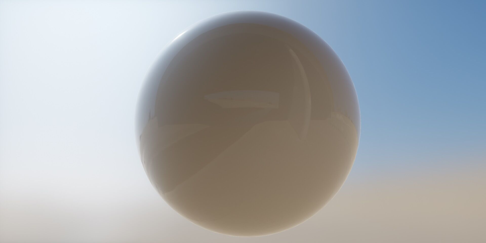
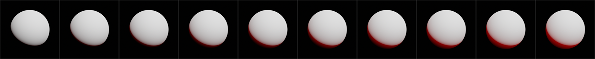

材质
========
###### 　　[English](https://github.com/ray-cast/ray-mmd/blob/dev/Materials/README.md) &nbsp; [中文文档](https://github.com/ray-cast/ray-mmd/blob/dev/Materials/README_chs.md)

　　该文档主要用于快速说明材质作用以方便查询，基于物理的渲染(PBR)是近几年迅速流行起来的一套渲染管线，因此你需要先了解一些关于物理渲染的知识，以帮助更快的了解基于物理的渲染

　　通常来说有三种不同的材质描述，该渲染主要使用**albedo/smoothness/metalness**材质，而不是**albedo/roughness/metalness**和**diffuse/specular/gloss**，
因为粗糙度(roughness)不容易被人理解和使用，而后者并不属于基于物理的范畴，本文会介绍所有在Ray-MMD中常用的条目，并且添加一些详细的wiki链接，
同时你可以通过复制粘贴 `material_2.0.fx` 来创建一个新的材质用于渲染你的模型.

ALBEDO:
------
　　`Albedo` 也被称为 `基本色`, 定义了材质的整体颜色并且取值范围在`0.0` ~ `1.0`

* ##### ALBEDO_MAP_FROM  
    通过以下数值设置到`ALBEDO_MAP_FROM`,可以将一个 `线性的颜色` 或者 `纹理` 用于修改模型中的颜色.

    `0` . 从`const float3 albedo = 1.0`提取颜色(线性颜色)用于模型.  
    `1` . 模型的基本颜色将使用来至`ALBEDO_MAP_FILE`的相对或者绝对的(bmp, png, jpg, tga, dds, gif, apng)图片路径.  
    `2` . 模型的基本颜色将使用来至`ALBEDO_MAP_FILE`的相对或者绝对的GIF/APNG的路径.  
    `3` . 模型的基本颜色将使用来至`PMX`模型中的`纹理`插槽的图片.  
    `4` . 模型的基本颜色将使用来至`PMX`模型中的`镜面`插槽的图片.  
    `5` . 模型的基本颜色将使用来至`PMX`模型中的`Toon`插槽的图片.  
    `6` . 模型的基本颜色将使用来至`AVI`视频或者渲染后的图像,需要先放置Extension/DummyScreen/中的x文件.  
    `7` . 将PMX中的`环境色`用于替换模型的颜色.  
    `8` . 将PMX中的`镜面色`用于替换模型的颜色.  
    `9` . 将PMX中的`光泽度`用于替换模型的颜色. // 该选择只能被光滑度使用  

* ##### ALBEDO_MAP_UV_FLIP
    通过以下数值设置到`ALBEDO_MAP_UV_FLIP`可以`水平`或者`垂直`翻转纹理坐标

	`0` . 无效  
    `1` . `X`轴水平翻转  
    `2` . `Y`轴垂直翻转  
    `3` . `X`和`Y`轴同时翻转  

* ##### ALBEDO_MAP_APPLY_SCALE  
    如果`ALBEDO_MAP_FROM`使用的是纹理，并且想要修改纹理的颜色时可以设置以下数值

	`0` . 无效  
    `1` . 将const float3 albedo = 1.0;中的颜色和被使用中的贴图的的颜色进行相乘  
    `2` . 将const float3 albedo = 1.0;中的颜色和被使用中的贴图的的颜色进行指数运算  

* ##### ALBEDO_MAP_APPLY_DIFFUSE  
    从`PMX`模型中的扩散色乘算到贴图上.

* ##### ALBEDO_MAP_APPLY_MORPH_COLOR  
    如果表情中有(R+/G+/B+)控制器，则可以用来乘算到贴图上修改模型颜色

* ##### ALBEDO_MAP_FILE  
    如果设置了1或者2到`ALBEDO_MAP_FROM`时,需要将一个相对或者绝对的图片的路径输入到这里

    ##### 例如 :
    ###### 1. 如果xxx.png图片和material_2.0.fx是在同一个目录,可以将`xxx.png`输入到`ALBEDO_MAP_FILE`
    * `#define ALBEDO_MAP_FILE "xxx.png"`
    ###### 2. 如果xxx.png图片是在material_2.0.fx的上一级目录,需要添加一个`../`来描述图片是在`material_2.0.fx`的上一级目录
    * `#define ALBEDO_MAP_FILE "../xxx.png"`
    ###### 3. 如果xxx.png图片是在material_2.0.fx的上一级目录的其它目录中,需要添加一个`../其它目录名`来描述图片是在`material_2.0.fx`的上一级目录中的其他目录
    * `#define ALBEDO_MAP_FILE "../其他目录名/xxx.png"`
    ###### 4. 如果图片是来至其它的磁盘,需要将相对路径复制并替换所有的`\`为`/`
    * `#define ALBEDO_MAP_FILE "C:/Users/User Name/Desktop/xxx.png"`

    ##### Tips:
    * 可以使用 `../` 代替上一级目录
    * 替换所有的 `\` 为 `/`.

* ##### const float3 albedo = 1.0;
    当`ALBEDO_MAP_FROM`为`0`时，或者`ALBEDO_MAP_APPLY_SCALE`为`1`时, 你需要设置一个颜色到albedo，并且色彩范围是在0 ~ 1之间
    
    ##### 例:
    ###### 1. 如果红色是一个[归一化](https://en.wikipedia.org/wiki/Unit_vector)后的数值, 则可以设置到albedo为:
    * `const float3 albedo = float3(1.0, 0.0, 0.0);`
    ###### 2. 如果红色是一个[非归一化](https://en.wikipedia.org/wiki/Unit_vector)后的数值, 则可以设置到albedo为:
    * `const float3 albedo = float3(255, 0.0, 0.0) / 255.0;`
    ###### 3. 如果颜色是从显示器中提取的, 则需要将 [sRGB](https://en.wikipedia.org/wiki/SRGB) 转换到 [linear color-space](https://en.wikipedia.org/wiki/SRGB) 通过 `color ^ gamma`
    * 转换一个归一化后的颜色到线性的色彩空间 为:
      * `const float3 albedo = pow(float3(r, g, b), 2.2);`
    * 转换一个未归一化的颜色到线性的色彩空间 为:
      * `const float3 albedo = pow(float3(r, g, b) / 255.0, 2.2);`

* #### albedoMapLoopNum
    修改这里的数值可以将图片以瓷砖的形式增加纹理的迭代次数, 默认数值是 1 即 1x1 的瓷砖贴图
    ##### 例如:
    ###### 1. 如果 `X` 和 `Y` 时相同数值时则可以简单的设置同一个数值为:
	* `const flaot albedoMapLoopNum = 2;`  
    或者
    * `const flaot2 albedoMapLoopNum = 2;`
    ###### 2. 否者, 左边的数值2代表X轴，右边的数值3代表Y轴
    * `const flaot2 albedoMapLoopNum = float2(2, 3);`

SubAlbedo:
--------------
* ##### ALBEDO_SUB_ENABLE
    通过将不同数值设置到`ALBEDO_SUB_ENABLE`，可以进一步修改模型的颜色

    `0` . 无效  
    `1` . albedo * albedoSub  
    `2` . albedo ^ albedoSub  
    `3` . albedo + albedoSub  
    `4` . 黑色素  
    `5` . 透明贴图混合  

* ##### ALBEDO_SUB_MAP_FROM (see [ALBEDO_MAP_FROM](#ALBEDO_MAP_FROM))
* ##### ALBEDO_SUB_MAP_UV_FLIP (see [ALBEDO_MAP_UV_FLIP](#ALBEDO_MAP_UV_FLIP))
* ##### ALBEDO_SUB_MAP_APPLY_SCALE (see [ALBEDO_MAP_APPLY_SCALE](#ALBEDO_MAP_APPLY_SCALE))
* ##### ALBEDO_SUB_MAP_FILE (see [ALBEDO_MAP_FILE](#ALBEDO_MAP_FILE))
* ##### const float3 albedoSub = 0.0 ~ 1.0;
* ##### const float2 albedoSubMapLoopNum = 0.0 ~ inf; (see [albedoMapLoopNum](#albedoMapLoopNum))

Alpha:
----------------
　　该选项对透明物体无效.

* ##### ALPHA_MAP_FROM (see [ALBEDO_MAP_FROM](#ALBEDO_MAP_FROM))
* ##### ALPHA_MAP_UV_FLIP (see [ALBEDO_MAP_UV_FLIP](#ALBEDO_MAP_UV_FLIP))
* ##### ALPHA_MAP_SWIZZLE
    输入不同的数值用于从纹理中不同的通道提取参数需要的数据.

    `0` . 从 `R` 通道中提取数据    
    `1` . 从 `G` 通道中提取数据    
    `2` . 从 `B` 通道中提取数据    
    `3` . 从 `A` 通道中提取数据    

    ##### 例如:
    ###### 1. 如果`光滑度贴图`在红色频道中, 你可以将它设置为:
    * `#define SMOOTHNESS_MAP_SWIZZLE 0`
    ###### 2. 如果`光滑度贴图`在绿色频道中, 你可以将它设置为:
    * `#define SMOOTHNESS_MAP_SWIZZLE 1`

* ##### ALPHA_MAP_FILE (see [ALBEDO_MAP_FILE](#ALBEDO_MAP_FILE))
* ##### const float alpha = 0.0 ~ 1.0;
* ##### const float2 alphaMapLoopNum = 0.0 ~ inf; (see [albedoMapLoopNum](#albedoMapLoopNum))

Normal:
-------------
　　法线贴图用于修改模型表面的凹凸以改变光照从而添加更多的阴影细节，默认时将总是使用带有三个通道的切线空间的法帖,同时还能够支持其它的一些类型的贴图,
你可以修改`NORMAL_MAP_TYPE`来改变默认行为，由于计算光源时必须模型具有法线信息，所以所有被渲染的模型都必须具有法线否则模型或者场景边缘上会产生一些白边的现象,
你可以尝试将场景模型放入PMXEditor，然后检查是否所有的法线的XYZ数值是否都不为0

* ##### NORMAL_MAP_FROM (see [ALBEDO_MAP_FROM](#ALBEDO_MAP_FROM))
* ##### NORMAL_MAP_TYPE
    由于历史的原因法线贴图有很多的变种，可以通过设置这里来指定, see UE4 [docs](https://docs.unrealengine.com/latest/INT/Engine/Rendering/LightingAndShadows/BumpMappingWithoutTangentSpace/index.html) for `PerturbNormalLQ` and `PerturbNormalHQ`.
    
    `0` . 将具有RGB的切线空间的法线贴图用于模型的法线.  
    `1` . 将只有RG的压缩后的切线空间的法线贴图用于模型的法线.  
    `2` . 以PerturbNormalLQ的方式计算凹凸贴图用作模型的法线. 在小的物体上工作的可能不是很好.  
    `3` . 以PerturbNormalHQ的方式计算凹凸贴图用作模型的法线 (High Quality).  
    `4` . 将RGB的世界空间的法线贴图用于模型的法线.  

* ##### NORMAL_MAP_UV_FLIP (see [ALBEDO_MAP_APPLY_SCALE](#ALBEDO_MAP_APPLY_SCALE))
* ##### NORMAL_MAP_FILE (see [ALBEDO_MAP_FILE](#ALBEDO_MAP_FILE))
* ##### const float normalMapScale = 0 ~ inf;
* ##### const float normalMapLoopNum = 0 ~ inf; (see [albedoMapLoopNum](#albedoMapLoopNum))

SubNormal
-------------
　　子法线主要用于在原始的基本法线上添加而外的细节,将两个法线贴图组合成为一个法线贴图,从而不需要修改原始贴图,
该方法主要通过[Reoriented Normal Mapping](https://www.shadertoy.com/view/4t2SzR)来完成的,如果你想要了解更多关于该技术的内容，可以看单击此[文档](http://blog.selfshadow.com/publications/blending-in-detail/)

* ##### NORMAL_SUB_MAP_FROM (see [ALBEDO_MAP_FROM](#ALBEDO_MAP_FROM))
* ##### NORMAL_SUB_MAP_TYPE (see [NORMAL_MAP_TYPE](#NORMAL_MAP_TYPE))
* ##### NORMAL_SUB_MAP_UV_FLIP (see [ALBEDO_MAP_APPLY_SCALE](#ALBEDO_MAP_APPLY_SCALE))
* ##### NORMAL_SUB_MAP_FILE (see [ALBEDO_MAP_FILE](#ALBEDO_MAP_FILE))
* ##### const float normalSubMapScale = 0.0 ~ inf;
* ##### const float normalSubMapLoopNum = 0.0 ~ inf; (see [albedoMapLoopNum](#albedoMapLoopNum))

Smoothness
-------------
　　光滑度用于描述模型表面的不均匀性,数值越大时模型反射周围越清晰,并且该帖图总是一个灰度贴图,
如果输入的贴图是彩色,将会从`R`通道中提取数据,或者可以通过修改`SMOOTHNESS_MAP_SWIZZLE`来指定其它通道,
默认时光滑度的计算是将PMX模型的高光转换成光滑度来使用的，因此你需要先修改`SMOOTHNESS_MAP_FROM`

* ##### SMOOTHNESS_MAP_FROM (see [ALBEDO_MAP_FROM](#ALBEDO_MAP_FROM))
* ##### SMOOTHNESS_MAP_TYPE
    描述光滑度贴图是使用光滑度还是粗糙度，以及如何转换粗糙度为光滑度

    `0` . `光滑度` (from Frostbite / CE5 textures)  
    `1` . 计算 `光滑度` 通过 `1.0 - 粗糙度 ^ 0.5` (from UE4/GGX/SubstancePainter2)  
    `2` . 计算 `光滑度` 通过 `1.0 - 粗糙度`       (from UE4/GGX/SubstancePainter2 with linear roughness)  

* ##### SMOOTHNESS_MAP_UV_FLIP (see [ALBEDO_MAP_UV_FLIP](#ALBEDO_MAP_UV_FLIP))
* ##### SMOOTHNESS_MAP_SWIZZLE (see [ALPHA_MAP_SWIZZLE](#ALPHA_MAP_SWIZZLE))
* ##### SMOOTHNESS_MAP_APPLY_SCALE (see [ALBEDO_MAP_APPLY_SCALE](#ALBEDO_MAP_APPLY_SCALE))
* ##### SMOOTHNESS_MAP_FILE (see [ALBEDO_MAP_FILE](#ALBEDO_MAP_FILE))

* ##### const float smoothness = 0.0 ~1.0;
* ##### const float smoothnessMapLoopNum = 1.0; (see [albedoMapLoopNum](#albedoMapLoopNum))

Metalness:
-------------
　　金属性仅仅只是修改模型的反射率，用于替代老式的渲染管线,是一个在绝缘体和导体的插值过程,数值越大时其反射色依赖`Albedo`贴图色,并且该帖图总是一个灰度贴图,
如果输入的贴图是彩色,将会从`R`通道中提取数据,或者可以通过修改`METALNESS_MAP_SWIZZLE`来指定其它通道,

* ##### METALNESS_MAP_FROM (see [ALBEDO_MAP_FROM](#ALBEDO_MAP_FROM))
* ##### METALNESS_MAP_UV_FLIP (see [ALBEDO_MAP_UV_FLIP](#ALBEDO_MAP_UV_FLIP))
* ##### METALNESS_MAP_SWIZZLE (see [ALPHA_MAP_SWIZZLE](#ALPHA_MAP_SWIZZLE))
* ##### METALNESS_MAP_APPLY_SCALE (see [ALBEDO_MAP_APPLY_SCALE](#ALBEDO_MAP_APPLY_SCALE))
* ##### METALNESS_MAP_FILE (see [ALBEDO_MAP_FILE](#ALBEDO_MAP_FILE))

* ##### const float metalness = 0.0 ~ 1.0;
* ##### const float metalnessMapLoopNum = 1.0; (see [albedoMapLoopNum](#albedoMapLoopNum))

Specular:
-------------
　　该选项是对metalness不大于0时提供一个基本反射率, 因此该选项不是MMD的高光贴图, 贴图允许支持彩色和灰色，但彩色的RGB贴图不允许和CUSTOM_ENABLE一起使用
不过你可以修改SPECULAR_MAP_TYPE,将其设置成灰度图, 如果你不希望模型反射镜面色，则可以设置数值0到`const float3 specular = 0.0;`

* ##### SPECULAR_MAP_FROM (see [ALBEDO_MAP_FROM](#ALBEDO_MAP_FROM))
* ##### SPECULAR_MAP_TYPE
    描述镜面色如何转换成反射率

    `0` . 通过`F(x) = 0.08*(x  )`将彩色的镜面贴图转换成反色系数 (from UE4 textures)  
    `1` . 通过`F(x) = 0.16*(x^2)`将彩色的镜面贴图转换成反色系数 (from Frostbite textures)  
    `2` . 通过`F(x) = 0.08*(x  )`将灰度的镜面贴图转换成反色系数 (from UE4 textures)  
    `3` . 通过`F(x) = 0.16*(x^2)`将灰度的镜面贴图转换成反色系数 (from Frostbite textures)  
    `4` . 使用反射率 (`0.04`) 代替镜面色 (`0.5`), 当`SPECULAR_MAP_FROM`数值为`0`时有效  

* ##### SPECULAR_MAP_UV_FLIP (see [ALBEDO_MAP_UV_FLIP](#ALBEDO_MAP_UV_FLIP))
* ##### SPECULAR_MAP_SWIZZLE (see [ALPHA_MAP_SWIZZLE](#ALPHA_MAP_SWIZZLE))
* ##### SPECULAR_MAP_APPLY_SCALE (see [ALBEDO_MAP_APPLY_SCALE](#ALBEDO_MAP_APPLY_SCALE))
* ##### SPECULAR_MAP_FILE (see [ALBEDO_MAP_FILE](#ALBEDO_MAP_FILE))
* ##### const float3 specular = 0.5;
    默认值将使用0.5的数值代替0.04的反射率系数

* ##### const float2 specularMapLoopNum = 1.0; (see [albedoMapLoopNum](#albedoMapLoopNum))

Occlusion
-------------
　　由于天顶光源是由无数方向发射的光线,因此无法实时的计算出环境光的遮蔽,一种简单的方式则是使用`SSAO`或者`环境光遮蔽贴图`来代替
而实时中的`SSAO`只能模拟小范围的闭塞，所以可能需要离线烘培出`环境光遮蔽贴图`，此贴图是一种非常近视的手法用于模拟环境光的大范围闭塞
所以能够产生更真实的效果,如果你不希望某个物体反射天空中的漫反射以及镜面反射,你可以将该参数设置为0

* ##### OCCLUSION_MAP_FROM (see [ALBEDO_MAP_FROM](#ALBEDO_MAP_FROM))
* ##### OCCLUSION_MAP_TYPE
    用于描述烘培后的贴图是使用的sRGB色域还是线性的色彩空间

    `0` . 从sRGB的色彩空间中提取环境光遮蔽  
    `1` . 从线性的色彩空间中提取环境光遮蔽  
    `2` . 从sRGB的色彩空间以及使用模型的第二组UV提取环境光遮蔽  
    `3` . 从线性的色彩空间以及使用模型的第二组UV提取环境光遮蔽  

* ##### OCCLUSION_MAP_UV_FLIP (see [ALBEDO_MAP_UV_FLIP](#ALBEDO_MAP_UV_FLIP))
* ##### OCCLUSION_MAP_SWIZZLE (see [ALPHA_MAP_SWIZZLE](#ALBEDO_MAP_UV_FLIP))
* ##### OCCLUSION_MAP_APPLY_SCALE (see [ALBEDO_MAP_APPLY_SCALE](#ALBEDO_MAP_APPLY_SCALE))

* ##### const float occlusion = 0.0 ~ 1.0;
* ##### const float occlusionMapLoopNum = 0.0 ~ inf; (see [albedoMapLoopNum](#albedoMapLoopNum))

Parallax:
-------------
　　你可以将高度贴图用于此处, 但在DX9中视差贴图无法和顶点位移同时工作

* ##### PARALLAX_MAP_FROM (see [ALBEDO_MAP_FROM](#ALBEDO_MAP_FROM))

* ##### PARALLAX_MAP_TYPE
    设置视察贴图的类型

    `0` . 忽略透明度  
    `1` . 不忽略透明度  

* ##### PARALLAX_MAP_UV_FLIP  (see [ALBEDO_MAP_UV_FLIP](#ALBEDO_MAP_UV_FLIP))
* ##### PARALLAX_MAP_SWIZZLE  (see [ALPHA_MAP_SWIZZLE](#ALPHA_MAP_SWIZZLE))
* ##### PARALLAX_MAP_FILE (see [ALBEDO_MAP_FILE](#ALBEDO_MAP_FILE))

* ##### const float parallaxMapScale = 0.0 ~ inf;
* ##### const float parallaxMapLoopNum = 0.0 ~ inf; (see [albedoMapLoopNum](#albedoMapLoopNum))

Emissive
-------------
　　你可以添加一个光源到场景并且绑定该光源到自发光的材质骨骼，用于制造自发光的照明

* ##### EMISSIVE_ENABLE
* ##### EMISSIVE_MAP_FROM (see [ALBEDO_MAP_FROM](#ALBEDO_MAP_FROM))
* ##### EMISSIVE_MAP_UV_FLIP (see [ALBEDO_MAP_UV_FLIP](#ALBEDO_MAP_UV_FLIP))
* ##### EMISSIVE_MAP_APPLY_SCALE (see [ALBEDO_MAP_APPLY_SCALE](#ALBEDO_MAP_APPLY_SCALE))
* ##### EMISSIVE_MAP_APPLY_MORPH_COLOR (see [ALBEDO_MAP_APPLY_MORPH_COLOR](#ALBEDO_MAP_APPLY_MORPH_COLOR))

* ##### EMISSIVE_MAP_APPLY_MORPH_INTENSITY
   将多光源中的(Intensity+/-)表情用于材质.
* ##### EMISSIVE_MAP_APPLY_BLINK
   设置以下的数值，可以使材质产生自发光闪烁的效果.

   `0` . 无效  
   `1` . 将`const float3 emissiveBlink`中的数值与自发光乘算. 例 : const float3 emissiveBlink = float3(1.0, 2.0, 3.0);  
   `2` . 将表情控制器中的`Blink`表情应用于自发光, 多光源的扩展功能

* ##### EMISSIVE_MAP_FILE ([ALBEDO_MAP_FILE](#ALBEDO_MAP_FILE))

* ##### const float3 emissive = 0.0 ~ 1.0;
* ##### const float3 emissiveBlink = 0.0 ~ 10.0;
* ##### const float  emissiveIntensity = 0 ~ 100 and above
* ##### const float2 emissiveMapLoopNum = 0.0 ~ inf; (see [albedoMapLoopNum](#albedoMapLoopNum))

Shading Model ID
-------------
* ##### CUSTOM_ENABLE
    | ID | Material          | CustomA   | CustomB |
    | :- |:------------------|:----------|:--------|
    | 0  | 默认 | 无效 | 无效 |
    | 1  | 皮肤 | 曲率 | 散射色 |
    | 2  | 自发光 | 无效 | 无效 |
    | 3  | 各向异性 | 各项异性成都 | 切线扰动 |
    | 4  | 玻璃 | 曲率 | 散射色 |
    | 5  | 布料 | 光泽度 | 绒毛颜色 |
    | 6  | 清漆 | 光滑度 | 无效 |
    | 7  | 次表面 | 曲率 | 散射色 |
    | 8  | 卡通着色 | 阴影阈值  | 阴影色 |
    | 9  | ToonBased Shading | 阴影阈值  | 阴影色 |

    ##### Tips:  
    `Subsurface` : `曲率`也被称为`不透明度`,定义了材质的模糊强度以及透射强度,更多信息可以查看UE4 [docs](https://docs.unrealengine.com/latest/INT/Engine/Rendering/Materials/LightingModels/SubSurfaceProfile/index.html)  
	
    `Glass` : 为了使材质的折射能够工作，必须让`PMX`的透明度小于`0.999`  
    `Cloth` : `光泽度`是一个在`GGX`和`InvGGX`的插值系数,更多信息可以查看[link](http://blog.selfshadow.com/publications/s2017-shading-course/imageworks/s2017_pbs_imageworks_sheen.pdf)  
    `Cloth` : `毛绒色`是fresnel中f0的参数,定义了材质的基本反射色使用sRGB的色彩  
    `Toon`  : 更多信息可以查看[link](https://zhuanlan.zhihu.com/p/26409746)  

* ##### CUSTOM_A_MAP_FROM  (see [ALBEDO_MAP_FROM](#ALBEDO_MAP_FROM))
* ##### CUSTOM_A_MAP_UV_FLIP (see [ALBEDO_MAP_UV_FLIP](#ALBEDO_MAP_UV_FLIP))
* ##### CUSTOM_A_MAP_COLOR_FLIP
* ##### CUSTOM_A_MAP_SWIZZLE (see [ALPHA_MAP_SWIZZLE](#ALPHA_MAP_SWIZZLE))
* ##### CUSTOM_A_MAP_APPLY_SCALE (see [ALBEDO_MAP_APPLY_SCALE](#ALBEDO_MAP_APPLY_SCALE))
* ##### CUSTOM_A_MAP_FILE "custom.png" (see [ALBEDO_MAP_FILE](#ALBEDO_MAP_FILE))

* ##### const float customA = 0.0 ~ 1.0; (linear-space)
* ##### const float customAMapLoopNum = 1.0; (see [albedoMapLoopNum](#albedoMapLoopNum))

* ##### CUSTOM_B_MAP_FROM (see [ALBEDO_MAP_FROM](#ALBEDO_MAP_FROM))
* ##### CUSTOM_B_MAP_UV_FLIP (see [ALBEDO_MAP_UV_FLIP](#ALBEDO_MAP_UV_FLIP))
* ##### CUSTOM_B_MAP_COLOR_FLIP
* ##### CUSTOM_B_MAP_APPLY_SCALE (see [ALBEDO_MAP_APPLY_SCALE](#ALBEDO_MAP_APPLY_SCALE))
* ##### CUSTOM_B_MAP_FILE "custom.png" (see [ALBEDO_MAP_FILE](#ALBEDO_MAP_FILE))

* ##### const float3 customB = 0.0 ~ 1.0; (sRGB color-space)
* ##### const float2 customBMapLoopNum = 1.0; (see [albedoMapLoopNum](#albedoMapLoopNum))

FAQ:
--------------------
* What is sRGB-color and Gamma
    * The Gamma is near 2.2 used most of time, About sRGB and Gamma, You can see docs for more information  
    * `https://developer.nvidia.com/gpugems/GPUGems3/gpugems3_ch24.html`  
    * `https://en.wikipedia.org/wiki/SRGB`  

* What is gloss map
    * Gloss map is a `smoothness map`

* How to use roughness map
    * Enter the path to the `SMOOTHNESS_MAP_FILE` and set `SMOOTHNESS_MAP_TYPE` to 1

* Where melanin
    * It has moved into `ALBEDO_SUB_ENABLE`, see `ALBEDO_SUB_ENABLE` for more information

* Why increase number of parallaxMapLoopNum will increase the loop number of albedo, normals, etc  
    * Bacause parallax coordinates can be calculated from `height map`,that are then used to access textures with `albedo`, `normals`, `smoothness`, `metalness`, etc, In other words like fetched data (`albedo`, `normals`, etc) from parallax coordinates * `parallaxMapLoopNum` * `albedo`/`normal`/MapLoopNum
