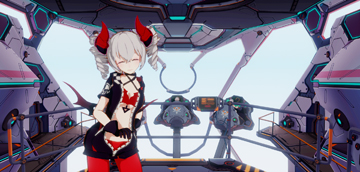
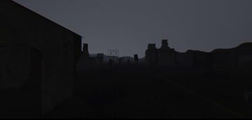

Ray-MMD
========
### Physically-Based Rendering ###
　　

　　Ray-MMD is a free, powerful library and an extension pack of [mikumikudance](http://www.geocities.jp/higuchuu4/index_e.htm), offering an easy way of adding physically-based rendering with high-freedom of operation. it is written in hlsl lang with DX9 env and based on [mikumikueffect](https://bowlroll.net/file/35012). 

　　There are lots of new features and better effect TODO, but now i don't have the more time to do it at the same pace, only with your support, Ray-MMD can go further, so if you like my shader or have the means to do so, please consider financial support.Your help is very useful for me. Thanks! 

　　Patreon:
 　　

　　支付宝:
 　　

Screenshots :
------------

Download :
------------
* [Ray-MMD - 1.3.1v2 (zip)](https://github.com/ray-cast/ray-mmd/archive/1.3.1v2.zip)  (updated: 27. Apr 2017)
* [Ray-MMD - 1.3.1v2 (tar.gz)](https://github.com/ray-cast/ray-mmd/archive/1.3.1v2.tar.gz)  (updated: 27. Apr 2017)
* [Ray-MMD - 1.4.0beta v2 (zip)](https://github.com/ray-cast/ray-mmd/archive/140beta2.zip) (updated: 30. Jul 2017)
* [Ray-MMD - 1.4.0beta v2 (tar.gz)](https://github.com/ray-cast/ray-mmd/archive/140beta2.tar.gz) (updated: 30. Jul 2017)
- Latest changes - Major allocator changes:
	- Support for Depth Of Field
	- Support for Toon material
	- Support for edge line shading
	- Material : Optimize and improve the gbuffer
	- Material : Better Cloth
	- Material : Better Skin when used ao map [(preview)](https://raw.githubusercontent.com/ray-cast/ray-mmd/developing/Shader/screenshots/ao.jpg)
	- Shadow : Optimize and improve the quality (It now has 4 tabs (PSSM1 - PSSM4) to calculate the sun shadow)
	- Time of day : Add the SunPhase and SunTurbidity 
	- FilmGrain : Added black borders around a video
	- Fix issue : that caused a FilmGrain cannot be work with others MME
	- Fix issue : that caused a LightBloom cannot be work with others MME
	- Fix issue : that caused a FXAA cannot be work with others MME
	- Fix issue : that caused a SMAA cannot be work with others MME

Requirement :
------------
* [MikuMikuDance](http://www.geocities.jp/higuchuu4/index_e.htm) - 926ver (x64) (Without Anti-Aliasing)
* [MikuMikuEffect](https://bowlroll.net/file/35012) - 037ver (x64)
* Direct3D 9 With Shader Model 3.0 (ps_3_0)

Features :
------------
* Physically-Based Material: albedo, metallic, smoothness/roughness, specular/reflectance, emissive, etc
* Clear coat material with absorption to simulate a second layer
* Cloth material with cloth-DFG to simulate a specular reflection
* Anisotropic material to simulate a specular reflection
* Special-Case Materials Wetness
* Approximation subsurface scattering materials
* Cook-Torrance microfacet specular BRDF (GGX) and burley diffuse BRDF
* Physical light units
* Multiple light sources (Point, spot, sun, area, ies)
* IES light profiles (point and spot light support)
* Soft shadow (PCF, VSM, PSSM)
* Omni light shadow support based on dual-paraboloid project
* HDR linear lighting
* Volumetric light (point, spot and ies light source support)
* Volumetric fog (cube and sphere fog support)
* Light shaft effect
* Approximation atmospheric fog and sky scattering
* Ground fog effect
* Skybox based on RGBT encode
* Image-based lighting based on RGBT encode
* Screen Space Reflection
* Screen Space Ambient Occlusition
* Screen Space Subsurface Scattering
* Post-Process Bokeh Depth Of Field
* Post-Process Bloom
* Post-Process Eye adaptation
* Post-Process Tone-mapping (ACES-like,Reinhard,Hable,Hejl2015,NaughtyDog support)
* Post-Process Color Balance
* Post-Process FXAA
* Post-Process SMAA
* Post-Process stereo rendering

Resources :
------------
- HDRi
	- sIBL Archive - Hdrlabs.com \[[link](http://www.hdrlabs.com/sibl/archive.html)\].
	- ++skies; - **[aokcub](https://twitter.com/aokcub_cg)** \[[link](https://aokcub.net/cg/incskies/)\].
	- USC Institute \[[link](http://gl.ict.usc.edu/Data/HighResProbes)\].
- Text editor
	- Notepad++ \[[link](https://notepad-plus-plus.org)\].
	- Visual studio code \[[link](http://code.visualstudio.com/Download)\].
- Addons
	- Ray-MMD for substance painter 2.x \[[link](https://github.com/ray-cast/mmd-export)\].

Credits:
-------------
Financially supported on [Patreon](http://www.patreon.com/cubizer)  
`Thanks!, If you would like to be added or remove from this list Please contact me`

##### Gold supporters:
* Sarashina - 更科
* Birdway

Contact:
------------
* Reach me via Twitter: [@Rui](https://twitter.com/Rui_cg).

[License (MIT)](https://raw.githubusercontent.com/ray-cast/ray-mmd/developing/LICENSE.txt)
-------------------------------------------------------------------------------
	Copyright (C) 2016-2017 Ray-MMD Developers. All rights reserved.

	https://github.com/ray-cast/ray-mmd

	Permission is hereby granted, free of charge, to any person obtaining a
	copy of this software and associated documentation files (the "Software"),
	to deal in the Software without restriction, including without limitation
	the rights to use, copy, modify, merge, publish, distribute, sublicense,
	and/or sell copies of the Software, and to permit persons to whom the
	Software is furnished to do so, subject to the following conditions:

	The above copyright notice and this permission notice shall be included
	in all copies or substantial portions of the Software.

	THE SOFTWARE IS PROVIDED "AS IS", WITHOUT WARRANTY OF ANY KIND, EXPRESS
	OR IMPLIED, INCLUDING BUT NOT LIMITED TO THE WARRANTIES OF MERCHANTABILITY,
	FITNESS FOR A PARTICULAR PURPOSE AND NONINFRINGEMENT.  IN NO EVENT SHALL
	BRIAN PAUL BE LIABLE FOR ANY CLAIM, DAMAGES OR OTHER LIABILITY, WHETHER IN
	AN ACTION OF CONTRACT, TORT OR OTHERWISE, ARISING FROM, OUT OF OR IN
	CONNECTION WITH THE SOFTWARE OR THE USE OR OTHER DEALINGS IN THE SOFTWARE.

References :
--------
* Moving to the Next Generation - The Rendering Technology of Ryse \[[link](http://www.crytek.com/download/2014_03_25_CRYENGINE_GDC_Schultz.pdf)\].
* ACES Filmic Tone Mapping Curve \[[link](https://knarkowicz.wordpress.com/2016/08/31/hdr-display-first-steps/)\].
* Compact Normal Storage for small G-Buffers \[[link](http://aras-p.info/texts/CompactNormalStorage.html)\].
* Convert Blinn-Phong to Beckmann distribution \[[link](http://simonstechblog.blogspot.de/2011/12/microfacet-brdf.html)\].
* Spherical Gaussian approximation for Blinn-Phong, Phong and Fresnel \[[link](https://seblagarde.wordpress.com/2012/06/03/spherical-gaussien-approximation-for-blinn-phong-phong-and-fresnel/)\].
* Physically Based Area Lights \[[link](http://www.frostbite.com/wp-content/uploads/2014/11/course_notes_moving_frostbite_to_pbr.pdf)\].
* Physics and Math of Shading \[[link](http://blog.selfshadow.com/publications/s2015-shading-course/hoffman/s2015_pbs_physics_math_slides.pdf)\].
* Compact YCoCg Frame Buffer for small IBL-Buffer \[[link](http://jcgt.org/published/0001/01/02/)\].
* RGBM color encoding \[[link](http://graphicrants.blogspot.com/2009/04/rgbm-color-encoding.html)\].
* Horizon Occlusion for IBL \[[link](http://marmosetco.tumblr.com/post/81245981087)\].
* Screen space glossy reflections \[[link](http://roar11.com/2015/07/screen-space-glossy-reflections/)\].
* Parallax Occlusion Map \[[link](http://sunandblackcat.com/tipFullView.php?topicid=28)\].
* Convert Temperature to RGB \[[link](https://github.com/davidf2281/ColorTempToRGB)\].
* Texture repetition \[[link](http://www.iquilezles.org/www/articles/texturerepetition/texturerepetition.htm)\].
* Pre-Integrated Skin Shading \[[link](http://simonstechblog.blogspot.com/2015/02/pre-integrated-skin-shading.html)\]
* Normal Blending in Detail \[[link](http://blog.selfshadow.com/publications/blending-in-detail/)\]
* An Approximation to the Chapman Grazing-Incidence Function for Atmospheric Scattering \[[link](http://www.gameenginegems.net/gemsdb/article.php?id=1133)\]
* Bump map to normal \[[link](https://docs.unrealengine.com/latest/attachments/Engine/Rendering/LightingAndShadows/BumpMappingWithoutTangentSpace/mm_sfgrad_bump.pdf)\]
* Special-Case Materials Wetness \[[link](http://advances.realtimerendering.com/other/2016/naughty_dog/NaughtyDog_TechArt_Final.pdf)\]
* Mip Fog \[[link](http://advances.realtimerendering.com/other/2016/naughty_dog/NaughtyDog_TechArt_Final.pdf)\]
* Gaussian-kernel-calculator \[[link](http://dev.theomader.com/gaussian-kernel-calculator/)\]
* Ray Box Intersection on the GPU \[[link](https://github.com/hpicgs/cgsee/wiki/Ray-Box-Intersection-on-the-GPU)\]
* Hexagonal Bokeh Blur Revisited \[[link](https://colinbarrebrisebois.com/2017/04/18/hexagonal-bokeh-blur-revisited/)\]
* Practical Post-Process Depth of Field \[[link](https://developer.nvidia.com/gpugems/GPUGems3/gpugems3_ch28.html)\]
* Approximation of the IBL’s DFG term for a cloth BRDF \[[link](https://gist.github.com/romainguy/52d0e7f070d9ed7b44a0327d735fe33e)\]
