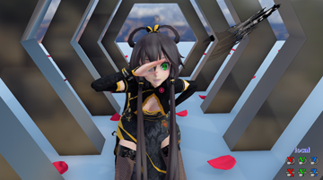
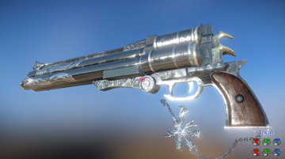
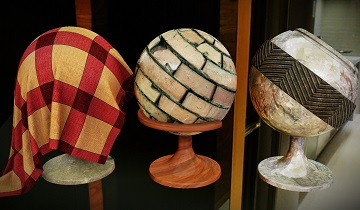
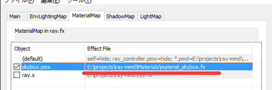
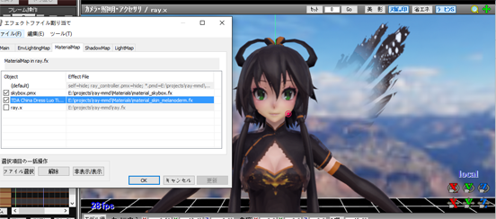
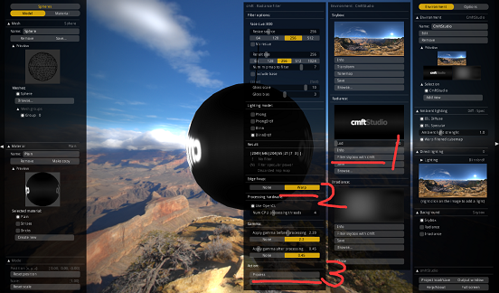
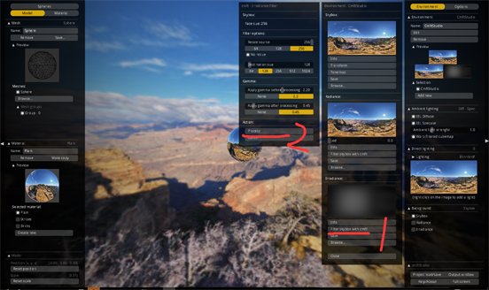
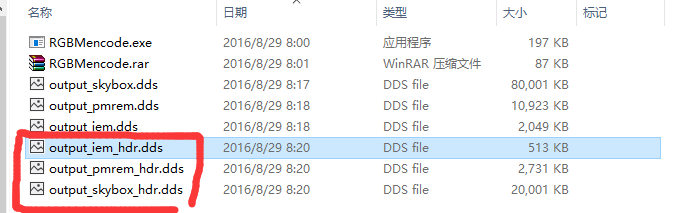

Ray-MMD
========
### 基于物理的MikuMikuDance渲染库 ###
#### Screenshot :
[](Screenshot/LuoTianYi.png)
[](Screenshot/pistol.png)
[](Screenshot/sphere.jpg)

#### 更新内容 :
##### 2016-8-30 ver 1.0.3 beta
* 改进默认材质对Diff&Spec的兼容
* 添加了新的HDR和工具，以及更新HDR制作教程(现在可以支持HDR的天空了)
* 添加了LightMap用于渲染多个光源
* 添加了点光源，聚光灯，方形区域光和球形区域光 (都会根据材质进行光照)
* 添加了天空盒旋转表情 (EnvRotateX/Y/Z)
* 添加了主光源阴影用于IBL的表情 (EnvShadow)
* 添加了Blub表情 (B快门)
* 修复只启用次法线时normalMapSubScale无效

##### 2016-8-25 ver 1.0.2
* 修复了不启用USE_CUSTOM_MATERIAL产生的Bug
* 修复了发光贴图的Bug
* 修复了光滑贴图和金属性贴图的Bug
* 表情Noise改为FilmGrain
* 添加了BloomRadius表情，产生更大范围的Bloom
* 增加了metalnessBaseSpec(默认0.04)，如果不想反射太强改为 0, 用于皮肤的渲染
* 添加了transmittanceStrength，指定SS的模糊程度
* 添加了HDR的dds文件支持(下个版本将会出将HDR转DDS支持的工具)
* 垂直翻转了天空盒纹理
* 增加了低版本的兼容性
* 下版本预计会出多光源支持，以及改善alpha的兼容

##### 2016-8-22 ver 1.0.1 版本
* 增加材质单独存放其它目录(必须和 material_common.fxsub) 一起打包
* 增加控制SSAO产生阴影半径的大小
* 增加了相机色散，以及色散半径的效果 (表情: Dispersion && Dispersion Radius)
* 增加了因相机曝光不足产生的噪点效果 (表情: Noise)
* 优化了SSSS (提高了一定的fps)

#### 教程 :
##### 1.0 文件夹介绍 :
* EnvLighting : 环境光(IBL)相关特效
* Main : 添加物体基本的光照
* Materials : 用于指定物体材质 (如皮肤，金属，天空盒....)
* Shadow : 用于渲染物体阴影的特效
* Skybox : 基本的天空盒特效和纹理
* ray.conf : 配置文件(可自行修改)
* ray.x : 渲染主文件
* ray_controller.pmx : 调整光强，SSAO，泛光..等效果
* ColorBalance.pmx : 色彩平衡

##### 2.0 载入模型 :
* 将ray.x载入到MMD中
* 添加Skybox/skybox.pmx并且在MaterialMap选择Materials/material_skybox.fx  
[](Screenshot/2.2.png)
* 添加任意模型到MMD，并在Main板块选择Main.fx
* 在MaterialMap板块中，对刚载入的模型在Materials文件夹中选择对应的材质
* 分配完后效果图如下:  
[](Screenshot/2.5.png)

##### 3.0 材质介绍 :
* 基于物理的模型大体分为 
* albedo 物体的反照率，可以认为是物体的颜色/贴图
* normal 垂直物体表面的主要法线，光照需要用到
* sub normal 控制物体表面细微的法线，如毛孔，布料纹路
* smoothness : 物体表面的光滑度，例如指定金属时，越光滑反射的环境也就越清晰 
* metalness : 物体的金属程度
* SSS : 指定物体内部的散射色
* emmisive : 控制部分表面的自发光

###### 3.1 启用材质
* 默认fx文件里是不启用自定义材质，需要将 USE_CUSTOM_MATERIAL 设置成 1
* 次表面散射和自发光的也是不开启的，需要将 SSS_ENABLE 和 EMMISIVE_ENABLE 设置成1
        
###### 3.2 纹理
* 同样的描述物体纹理也是不启用的，如果需要某项将如下这些设置成 1
    
```cpp
    #define ALBEDO_MAP_ENABLE
    #define NORMAL_MAP_ENABLE
    #define NORMAL_MAP_SUB_ENABLE
    #define SMOOTHNESS_MAP_ENABLE
    #define METALNESS_MAP_ENABLE
    #define SSS_MAP_ENABLE
    #define MELANIN_MAP_ENABLE
    #define EMMISIVE_MAP_ENABLE
```

* 如果材质在pmx文件中，可以启用以下
    
```cpp
    #define ALBEDO_MAP_IN_TEXTURE // 物体的基本贴图在Tex里
    #define NORMAL_MAP_IN_SPHEREMAP // 物体的法线贴图在Sph map里
    #define SMOOTHNESS_MAP_IN_TONEMAP // 物体的光滑度贴图在Toon map里
    #define METALNESS_MAP_IN_TONEMAP // 物体的金属贴图在Toon map里
```

* 如果没有指定在pmx中，可以将文件路径写到下面这些定义里

```cpp
    #define ALBEDO_MAP_FILE "c:/xxxx/yyyy.png"
    #define NORMAL_MAP_FILE ...
    #define NORMAL_MAP_SUB_FILE ...
    #define SMOOTHNESS_MAP_FILE ...
    #define METALNESS_MAP_FILE ...
    #define SSS_MAP_FILE ...
    #define MELANIN_MAP_FILE ...
    #define EMMISIVE_MAP_FILE ...
```

* 指定图片通道存放了哪些数据需要用到Swizzle

```cpp
    #define XXXXXXX_MAP_SWIZZLE_R // 表示某种材质R里存放了它的数据
    #define XXXXXXX_MAP_SWIZZLE_G // 表示某种材质G里存放了它的数据
    #define XXXXXXX_MAP_SWIZZLE_B // 表示某种材质B里存放了它的数据
    #define XXXXXXX_MAP_SWIZZLE_A // 表示某种材质A里存放了它的数据
    // 这里只对 smoothness，metalness，melanin 有效，也必须要指定
```

* 贴图迭代次数，和法线高度

```cpp
    const float xxxxxMapLoopNum = 1.0; // 应用在一个平面时大小是 1x1
    const float xxxxxMapLoopNum = 2.0; // 应用在一个平面时大小是 2x2

    const float normalMapScale = 1.0; // 用来指定法线贴图的强度，数值越大越明显
    const float normalMapSubScale = 1.0; // 用来指定子法线贴图的强度，数值越大越明显
```

* 有些时候UV的图片似乎上下颠倒了，可以将如下设置成 1
    
```cpp
    #define XXXXX_MAP_UV_FLIP 1
```

##### 4.0 全局设置 (ray_controller.pmx):
* DirectLight+/-直接光照中整体光强
* IndirectLight+/-间接光照中整体光强 (暂时只能控制SSAO产生的GI)
* SSAO+- 环境光遮蔽强度  
* SSAO Radius+- 环境光遮蔽的范围
* EnvLight+-环境光的漫反射光强
* EnvSpecLight+-环境光的镜面光强
* EnvRotateX/Y/Z 旋转天空盒的X/Y/Z轴
* EnvShadow 主光源阴影用于环境光阴影的强度
* BloomThreshold 提取最亮部分的阈值
* BloomRadius 产生泛光的大小
* BloomIntensity 泛光的整体强度
* Vignette 窗口四周的暗角(虚角)
* Exposure 曝光强度
* Blub 相机中的B快门
* Dispersion 相机色散的效果
* DispersionRadius 相机色散的区域大小
* FilmGrain 相机因曝光不足参数的噪点
* ToneMapping 色调映射的鲜艳度 (为0时采用ACES, 为1时使用Uncharted2)
* ShoStrength 亮度 (当ToneMapping越大时改值影响越大)
* LinStrength 灰度 (当ToneMapping越大时改值影响越大)
* LinWhite    消光 (当ToneMapping越大时改值影响越大)
* ToeNum      饱和度 (当ToneMapping越大时改值影响越大)  

##### 5.0 制作基于物理的环境光贴图(IBL)  旧:
　　预处理的环境光贴图需要对天空盒纹理处理所以需要借助以下工具
```
    https://github.com/dariomanesku/cmftStudio
```
* 启动cmftstudio
* 选择一张(dds,ktx,tga,hdr)的图片文件，如果没有这些格式需要自行转换
* 如下图点击右侧的图片然后浏览需要处理的天空盒图片  
* 如果是HDR文件，点ToneMapping，然后Apply即可  
[](Screenshot/4.1.png)
* 点击Radiance中的Filter skybox with cmft，选中Wrap模式并Process  
[](Screenshot/4.2.png)
* 点击Irradiance中的Fiter skybox with cmft，直接点Process即可  
[](Screenshot/4.3.png)
* 如下图分别保存出Radiance和Irradiance，因为MMD并不支持浮点格式纹理，因此保存为BGRA8
[](Screenshot/4.4.png)
[](Screenshot/4.5.png)
* 将导出的Irradiance和Radiance放入Skybox/textures/目录中
* 如图PMXEditor打开skybox.pmx，这里Texture里放渲染天空的纹理，Tone放Irradiance中的纹理SphereMap放Radiance中的纹理  
[](Screenshot/4.6.png)
* 至此完成了IBL需要的纹理，SphereMap模式需要改为加算/乘算，不然会无效

##### 6.0 制作基于物理的环境光贴图(IBL) 新:
　　以上方法适用于创建出非HDR文件的天空盒，接下介绍HDR文件如何使用  
　　因为MMD里不支持RGBA32F和RGBA16F的浮点格式，所以需要将数据压缩到RGBA8中  
　　因此作者写了一个RGBMencode工具，用于将cmftstudio保存的DDS用于MMD的渲染  

* 首先启动cmftstudio
* 选择一张(dds,ktx,tga,hdr)的图片文件，如果没有这些格式需要自行转换
* 如下图点击右侧的图片然后浏览需要处理的天空盒图片  
* 这里因为处理的是HDR文件了，不要再ToneMapping了  
[](Screenshot/4.1.png)
* 点击Radiance中的Filter skybox with cmft，选中Wrap模式，以及Gamma中全改为None并Process  
[](Screenshot/6.1.png)
* 点击Irradiance中的Fiter skybox with cmft，Gamma中全改为None，Process即可  
[](Screenshot/6.2.png)
* 处理完后效果图如下  
[](Screenshot/6.3.png)
* 接着将它们以RGBA16F或者RGBA32F的格式保存，并放入RGBMencode的同级目录下  
[](Screenshot/6.4.png)
* 分次拖拽它们到RGBMencode 依次输出对应的文件
* 并改为skydome_hdr.dds, skydiff_hdr.dds, skyspec_hdr.dds即可使用  
[](Screenshot/6.5.png)
* 这里提供一个天空盒的地址

```
    http://www.hdrlabs.com/sibl/archive.html
```